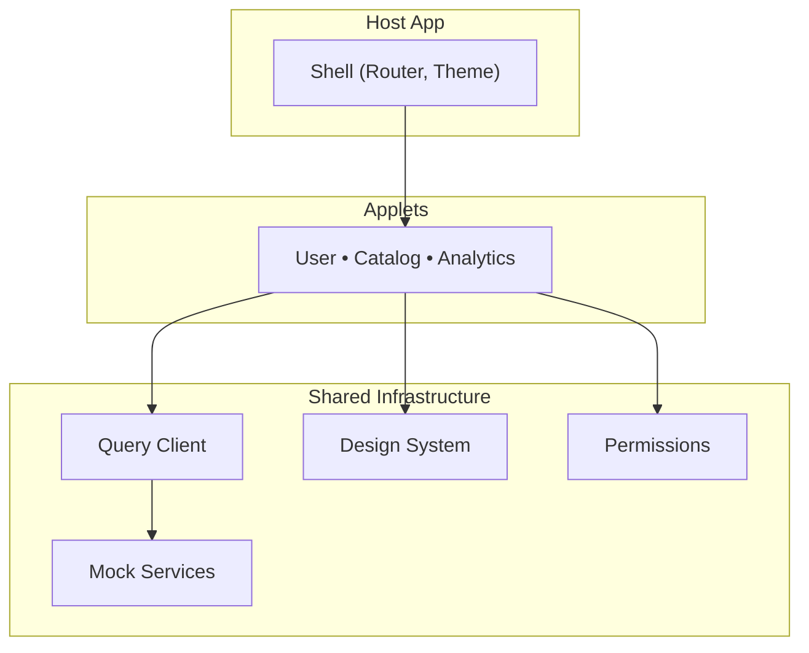
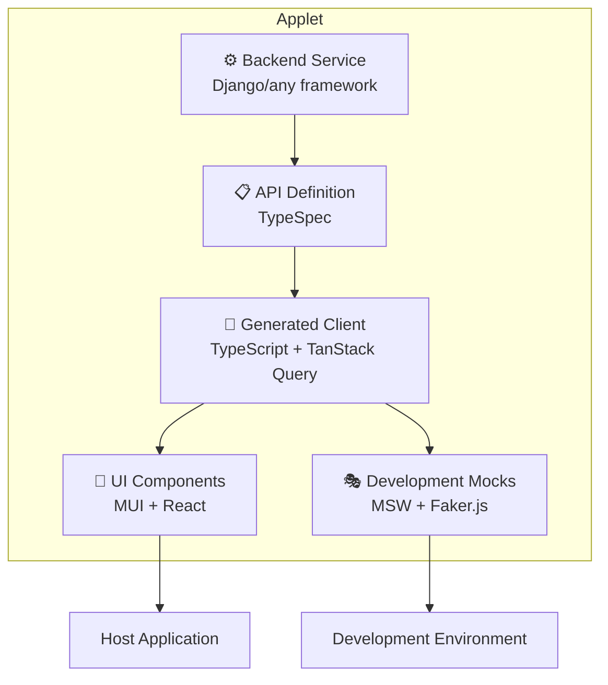
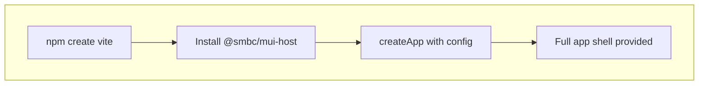
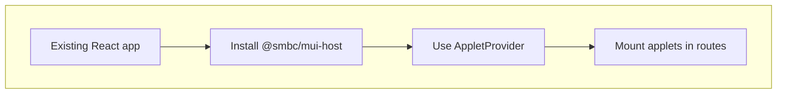
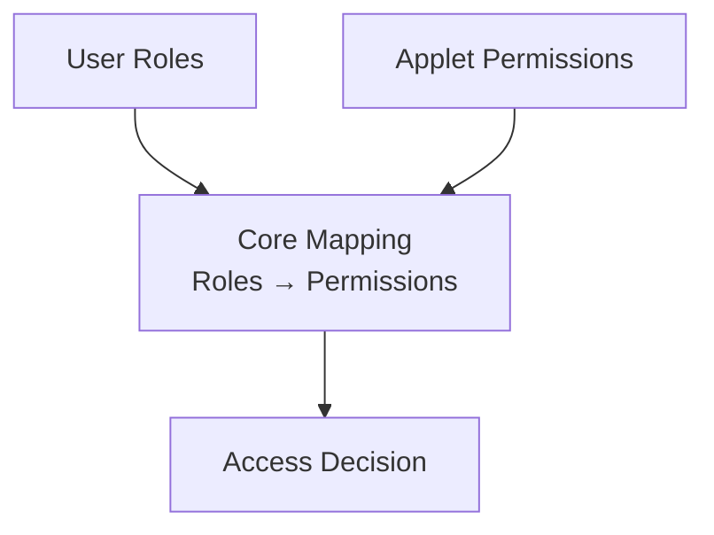
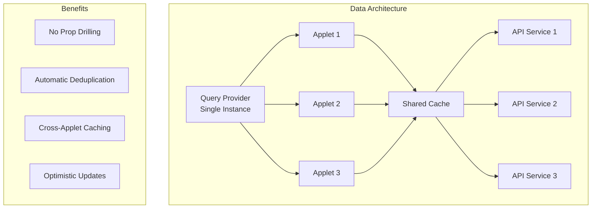
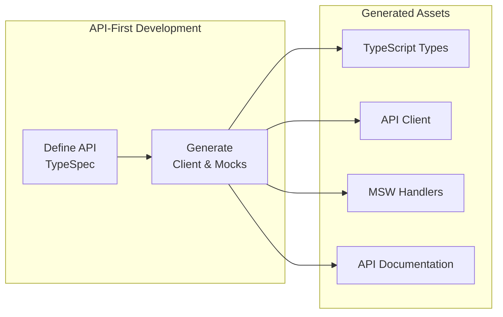

# Architecture Overview

The SMBC Applets Platform is a **scalable, type-safe architecture** for building enterprise applications through independent, self-contained **applets** while maintaining consistency, performance, and developer experience.

## 🏗️ Architecture Layers

### 1. Host Application Layer

The host application provides the shell and coordinates applets:



### 2. Applet Layer

Each business domain is a complete, self-contained applet:



### 3. Shared Infrastructure Layer

Common utilities and systems shared across all applets:

```
├── @smbc/mui-applet-core          # Core applet infrastructure
├── @smbc/mui-components           # Shared MUI components
│   └── @smbc/design-tokens        # Design token system
└── @smbc/shared-query-client      # Single QueryClient architecture
    ├── @smbc/react-openapi-client # API client utilities
    └── @smbc/msw-utils            # Mock generation tools
```

## 📱 Applet Structure

Each applet follows a standardized structure:

```
applets/user-management/
├── api/                   # TypeSpec API definition
│   ├── main.tsp           # OpenAPI schema
│   └── tsp-output/        # Generated OpenAPI JSON
├── api-client/            # Generated TypeScript client
│   ├── src/generated/     # Auto-generated types
│   ├── src/mocks/         # MSW mock handlers
│   └── src/client.ts      # Client configuration
├── mui/                   # React UI components
│   ├── src/components/    # Business components
│   ├── src/permissions.ts # Permission definitions
│   └── src/index.ts       # Applet export
└── django/                # Backend implementation
    ├── models.py          # Data models
    ├── views.py           # API endpoints
    └── urls.py            # URL routing
```

## 🚀 Easy Integration Paths

### Greenfield Implementation



```typescript
import { createApp } from "@smbc/mui-host";

createApp({
  config: {
    applets: ["@smbc/user-management-mui"],
    roles: ["Guest", "Staff", "Admin"],
    app: { name: "My SMBC App" },
  },
});
```

### Existing App Integration



```typescript
import { AppletProvider, AppletRoute } from '@smbc/mui-host'

<AppletProvider applets={['@smbc/user-management-mui']} roles={roles} user={user}>
  <Routes>
    <Route path="/users/*" element={<AppletRoute applet="user-management" />} />
  </Routes>
</AppletProvider>
```

## 🔐 Permission System

Role-based permissions with applet-specific scoping:



## 🔄 Data Flow Architecture

Single QueryClient pattern for optimal performance:



## 🎭 Development Experience

API-first development with automatic mock generation:



## 📦 Package Dependencies

Third party packages are externalized for optimal bundle management.
