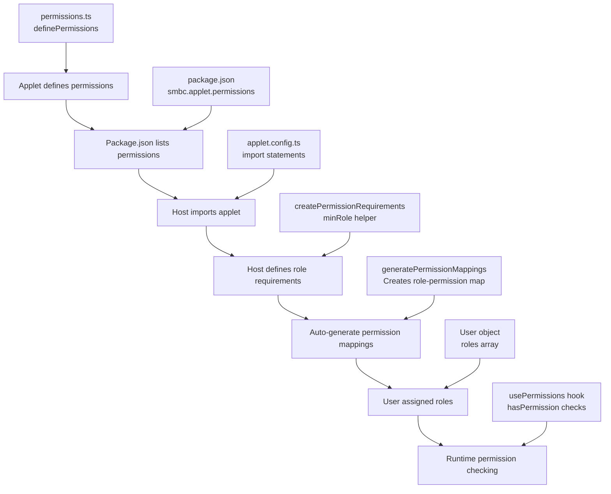

# SMBC Applet Permissions System

This document provides a comprehensive guide to understanding how the SMBC applet permissions system works, including the coordination between applets, hosts, and permission definitions.

## Table of Contents

1. [Overview](#overview)
2. [Core Components](#core-components)
3. [Package.json Configuration](#packagejson-configuration)
4. [Permission Flow](#permission-flow)
5. [Applet Implementation](#applet-implementation)
6. [Host Configuration](#host-configuration)
7. [Runtime Permission Checking](#runtime-permission-checking)
8. [Advanced Patterns](#advanced-patterns)
9. [Best Practices](#best-practices)
10. [Troubleshooting](#troubleshooting)

## Overview

The SMBC applet permissions system is a hierarchical, role-based access control (RBAC) system that provides:

- **Declarative Permission Definitions**: Applets define what permissions they need
- **Hierarchical Role System**: Roles are ordered from lowest to highest privilege
- **Automatic Permission Mapping**: Permissions are automatically mapped to roles
- **Type-Safe Configuration**: Full TypeScript support with autocomplete
- **Flexible Permission Contexts**: Support for different permission contexts within the same applet

## Core Components

### 1. Permission Definitions (`permissions.ts`)

Each applet defines its permissions using the `definePermissions` helper:

```typescript
// applets/user-management/mui/src/permissions.ts
import { definePermissions } from "@smbc/applet-core";

export default definePermissions("user-management", {
  VIEW_USERS: "Can view user list and profiles",
  CREATE_USERS: "Can create new user accounts",
  EDIT_USERS: "Can modify existing user information",
  DELETE_USERS: "Can remove user accounts",
  MANAGE_ROLES: "Can assign and modify user roles",
  VIEW_ANALYTICS: "Can view user analytics and reports",
});
```

This generates type-safe permission objects with the structure:

```typescript
{
  VIEW_USERS: {
    id: "user-management:view_users",
    name: "VIEW_USERS",
    description: "Can view user list and profiles"
  }
  // ... other permissions
}
```

### 2. Applet Export Structure

Each applet exports a standardized structure:

```typescript
// applets/user-management/mui/src/index.ts
import { Applet } from "./Applet";
import permissions from "./permissions";
import spec from "@smbc/user-management-api";

export default {
  permissions, // Permission definitions
  component: Applet, // Main applet component
  apiSpec: {
    // API specification
    name: "User Management API",
    spec,
  },
};
```

### 3. Host Role Configuration

The host application defines its role hierarchy and permission mappings:

```typescript
// apps/mui-host-dev/src/applet.config.ts
export const HOST_ROLES = [
  "Guest", // Lowest privilege
  "Customer",
  "Staff",
  "Manager",
  "Admin",
  "SuperAdmin", // Highest privilege
] as const;

// Define minimum required roles for each permission
const permissionRequirements = createPermissionRequirements({
  "user-management": minRole(userManagementApplet, {
    VIEW_USERS: "Staff", // Staff and above can view users
    CREATE_USERS: "Manager", // Manager and above can create users
    EDIT_USERS: "Manager", // Manager and above can edit users
    DELETE_USERS: "Admin", // Admin and above can delete users
    MANAGE_ROLES: "Admin", // Admin and above can manage roles
    VIEW_ANALYTICS: "Manager", // Manager and above can view analytics
  }),
});

// Auto-generate verbose permission mappings
export const ROLE_CONFIG: RoleConfig = {
  roles: [...HOST_ROLES],
  permissionMappings: generatePermissionMappings(
    HOST_ROLES,
    permissionRequirements,
  ),
};
```

This generates mappings like:

```typescript
{
  "user-management": {
    "user-management:view_users": ["Staff", "Manager", "Admin", "SuperAdmin"],
    "user-management:create_users": ["Manager", "Admin", "SuperAdmin"],
    "user-management:delete_users": ["Admin", "SuperAdmin"],
    // ...
  }
}
```

### Original Design Intent vs Better Approaches

#### Original Intent: Auto-Configuration from package.json

The idea was that after `npm install @smbc/user-management-mui`, a CLI tool would:

```typescript
// Theoretical: applet-cli configure
const pkg = require('@smbc/user-management-mui/package.json');
const { id, permissions, path, icon } = pkg.smbc.applet;

// Auto-generate applet.config.ts entry:
appendToConfig({
  id: "user-management",
  path: "/users",
  permissions: ["VIEW_USERS", "CREATE_USERS", ...],
  // But wait... how do we get the actual component?
  component: ??? // Can't import from string in package.json!
});
```

**Problems with this approach:**

1. **No Type Safety** - String-based permissions lose TypeScript benefits
2. **Can't Reference Code** - package.json can't reference the actual component/permissions objects
3. **Dual Source of Truth** - Permissions defined in both `permissions.ts` and `package.json`
4. **Static vs Dynamic** - package.json is static, but applets need dynamic configuration

#### Better Approach: TypeScript-First with Convention

Instead of package.json metadata, applets could export a standard configuration:

```typescript
// @smbc/user-management-mui/src/index.ts
export default {
  permissions, // Actual permission objects
  component: Applet, // Actual component
  apiSpec, // API specification
  // Standard configuration interface
  config: {
    id: "user-management",
    defaultPath: "/users",
    icon: PeopleIcon, // Actual icon component
    name: "User Management",
  },
};

// After npm install, a CLI tool generates:
// applet.config.ts
import userManagementApplet from "@smbc/user-management-mui";

export const APPLETS = [
  mountApplet(userManagementApplet, {
    id: userManagementApplet.config.id,
    path: userManagementApplet.config.defaultPath,
    icon: userManagementApplet.config.icon,
    permissions: [userManagementApplet.permissions.VIEW_USERS],
  }),
];
```

**Advantages:**

- ✅ Full type safety with autocomplete
- ✅ Single source of truth (TypeScript)
- ✅ Can reference actual components/icons
- ✅ IDE understands everything

#### Even Better: Plugin-Based Discovery

```typescript
// applets export a registration function
export default function register(host: AppletHost) {
  return host.registerApplet({
    id: "user-management",
    permissions,
    component: Applet,
    defaultConfig: {
      path: "/users",
      icon: PeopleIcon,
    },
    // Let the applet define its own role requirements
    roleRequirements: {
      VIEW_USERS: "Staff",
      CREATE_USERS: "Manager",
      DELETE_USERS: "Admin",
    },
  });
}

// Host just calls registration
import registerUserManagement from "@smbc/user-management-mui";

const host = new AppletHost();
registerUserManagement(host);
// Applet self-configures with defaults
```

#### For Pre-Installation Review (Security)

Instead of package.json, use a separate manifest file or CLI command:

```bash
# Better approach: Query the package's exported config
npx @smbc/applet-cli inspect @smbc/user-management-mui

# Output (generated from TypeScript):
Applet: User Management
Permissions Required:
  - VIEW_USERS (Can view user list and profiles)
  - CREATE_USERS (Can create new user accounts)
  - DELETE_USERS (Can remove user accounts)
Dependencies: React 18+, MUI 5+
```

This would run a lightweight script that imports just the config/permissions without executing the full applet.

### The Real Problem with package.json Metadata

The fundamental issue is that package.json is **data**, but applet configuration needs **code**:

- Components are code
- Icons are code
- Permission objects are code
- Configuration functions are code

Trying to bridge from static JSON to dynamic TypeScript creates complexity without benefits. The TypeScript-first approach keeps everything in one language with full type safety.

### Recommendation

1. **Remove unused `smbc.applet` metadata** from package.json
2. **Keep the TypeScript-first approach** that's already working
3. **If auto-configuration is needed**, build a CLI that:
   - Imports the applet's TypeScript exports
   - Generates typed configuration code
   - Maintains full type safety
4. **For security review**, create tools that analyze the TypeScript exports rather than duplicating data in package.json

The current working system (direct TypeScript imports) is actually better than the planned package.json approach. It just needs better tooling for discovery and configuration generation.

## Permission Flow



## Applet Implementation

### Applet Props: Required vs Custom Configuration

All applets must accept certain required props, but can also define custom props for configuration:

#### Required Props (Standard Pattern):
```typescript
export interface AppletProps {
  /** REQUIRED: The mount path for applet routing */
  mountPath: string;
  /** OPTIONAL: For passing children (rare) */
  children?: React.ReactNode;
}
```

#### Custom Configuration Props:
Some applets accept additional props for **configuration-time behavior**. For example, the user-management applet:

```typescript
export interface AppletProps {
  mountPath: string;                              // Required
  userType?: "all" | "admins" | "non-admins";    // Custom: filters displayed data
  permissionContext?: string;                     // Custom: changes permission context
}
```

**Key Insight**: Custom props like `userType` are **configuration, not permissions**. They allow the same applet to be reused in different contexts with different behavior:

```typescript
// Host configuration - Same applet, different behavior
const NonAdminUsers = () =>
  userManagementApplet.component({
    mountPath: "/user-management",
    userType: "non-admins",     // Shows only non-admin users
  });

const AdminUsers = () =>
  userManagementApplet.component({
    mountPath: "/admin/users",
    userType: "admins",         // Shows only admin users
    permissionContext: "admin-users", // Uses stricter permissions
  });
```

This pattern allows:
- **Single applet, multiple uses** - Same code serves different use cases
- **Configuration at mount time** - Behavior determined by host configuration
- **Context-specific permissions** - Different permission requirements per mount

#### Advanced Pattern: Component Injection

Custom props can also supply components or component factories to customize applet rendering:

```typescript
export interface AppletProps {
  mountPath: string;
  // Custom components
  customHeader?: React.ComponentType<{ title: string }>;
  customActions?: React.ComponentType<{ selectedItems: any[] }>;
  // Component factories
  createRowRenderer?: (rowType: string) => React.ComponentType<any>;
  // Theme overrides
  themeVariant?: "compact" | "spacious" | "mobile";
}

// Host can customize applet behavior
const CustomizedUserManager = () =>
  userManagementApplet.component({
    mountPath: "/custom-users",
    customHeader: ({ title }) => <CustomBrandedHeader title={title} />,
    customActions: ({ selectedItems }) => <CustomBulkActions items={selectedItems} />,
    themeVariant: "compact",
  });
```

**Key Benefits of Component Injection:**

1. **Host-Specific Customization**: The same applet can have completely different visual appearance in different hosts
2. **Brand Consistency**: Hosts can inject their own branded components while keeping the core applet logic
3. **Context-Aware Behavior**: Different deployment contexts (mobile, desktop, embedded) can provide different component implementations
4. **Functional Composition**: Components become configurable dependencies rather than hard-coded UI

**Real-World Examples:**

```typescript
// Enterprise host - formal branding
const EnterpriseUsers = () => userManagementApplet.component({
  customHeader: EnterpriseHeader,
  customActions: ComplianceActions,
  themeVariant: "formal"
});

// Consumer app - friendly branding
const ConsumerUsers = () => userManagementApplet.component({
  customHeader: FriendlyHeader,
  customActions: SimpleActions,
  themeVariant: "casual"
});

// Mobile app - space-optimized
const MobileUsers = () => userManagementApplet.component({
  customHeader: MobileHeader,
  customActions: SwipeActions,
  themeVariant: "compact"
});
```

This makes applets incredibly flexible while maintaining code reuse - the same business logic can serve multiple presentation needs through dependency injection applied to UI components.

### Component Structure

```typescript
// Main applet component
export const Applet: FC<AppletProps> = ({
  mountPath,
  userType = "all",
  permissionContext = "user-management", // Default context
}) => {
  // ... routing logic
};

// Permission-aware component
export const UserManager: FC<UserManagerProps> = ({
  userType,
  permissionContext = "user-management",
}) => {
  const { hasPermission } = usePermissions();

  // Check permissions at configuration level
  const config = useUserManagerConfig({
    userType,
    permissions: {
      canCreate: hasPermission(permissionContext, permissions.CREATE_USERS),
      canEdit: hasPermission(permissionContext, permissions.EDIT_USERS),
      canDelete: hasPermission(permissionContext, permissions.DELETE_USERS),
    },
    handlers: {
      onViewUser: onViewUser ? (user: any) => onViewUser(user.id) : undefined,
    },
  });

  return <DataView config={config} />;
};
```

### Configuration-Based Permission Control

Rather than scattered permission checks in JSX, permissions are evaluated once at the configuration level:

```typescript
// config/actions.ts - Row actions based on permissions
export const createRowActions = (permissions: PermissionFlags) => {
  const actions: any[] = [
    // View action is always available
    {
      type: "row" as const,
      key: "view",
      label: "View",
      icon: VisibilityIcon,
    },
  ];

  // Conditionally add actions based on permissions
  if (permissions.canEdit) {
    actions.push({
      type: "row" as const,
      key: "edit",
      label: "Edit",
      icon: EditIcon,
      color: "primary" as const,
      hidden: (user: any) => Boolean(user.__pendingDelete),
    });
  }

  if (permissions.canDelete) {
    actions.push({
      type: "row" as const,
      key: "delete",
      label: "Delete",
      icon: DeleteIcon,
      color: "error" as const,
      hidden: (user: any) => Boolean(user.__pendingDelete),
    });
  }

  return actions;
};
```

## Host Configuration

### Applet Mounting

```typescript
// apps/mui-host-dev/src/applet.config.ts
export const APPLETS: AppletMount[] = [
  // Standard mounting
  {
    id: "user-management",
    label: "User Management",
    apiSpec: userManagementApplet.apiSpec,
    packageName: "@smbc/user-management-mui",
    routes: [
      {
        path: "/user-management",
        label: "User Management",
        component: () =>
          userManagementApplet.component({
            mountPath: "/user-management",
            userType: "non-admins",
          }),
        icon: PeopleIcon,
        requiredPermissions: [userManagementApplet.permissions.VIEW_USERS.id],
      },
    ],
  },

  // Multiple mounts with different permission contexts
  {
    id: "admin-users",
    label: "Admin Users",
    apiSpec: userManagementApplet.apiSpec,
    packageName: "@smbc/user-management-mui",
    routes: [
      {
        path: "/admin/users",
        label: "Admin Users",
        component: () =>
          userManagementApplet.component({
            mountPath: "/admin/users",
            userType: "admins",
            permissionContext: "admin-users", // Different context!
          }),
        icon: PeopleIcon,
        requiredPermissions: [userManagementApplet.permissions.MANAGE_ROLES.id],
      },
    ],
  },
];
```

### App Integration

```typescript
// apps/mui-host-dev/src/App.tsx
export function App() {
  return (
    <MuiHostApp
      applets={APPLETS}
      roleConfig={ROLE_CONFIG} // Permission mappings
      demoUser={DEMO_USER} // User with roles
      permissionMapping={{
        // Context mapping
        "admin-users": "user-management",
      }}
      // ... other props
    />
  );
}
```

## Runtime Permission Checking

### usePermissions Hook

```typescript
const { hasPermission } = usePermissions();

// Check permission with context
const canEdit = hasPermission("user-management", permissions.EDIT_USERS);
const canDeleteAdmins = hasPermission("admin-users", permissions.DELETE_USERS);

// The hook resolves:
// 1. User roles from context
// 2. Permission context mapping
// 3. Role config permission mappings
// 4. Returns boolean result
```

### Permission Resolution Process

1. **User Roles**: `["Manager"]`
2. **Permission Check**: `hasPermission("user-management", permissions.DELETE_USERS)`
3. **Permission ID**: `"user-management:delete_users"`
4. **Required Roles**: `["Admin", "SuperAdmin"]` (from role config)
5. **Result**: `false` (Manager not in required roles)

## Advanced Patterns

### Multiple Permission Contexts

The same applet can be mounted with different permission requirements:

```typescript
// Regular user management - more permissive
"user-management": minRole(userManagementApplet, {
  VIEW_USERS: "Staff",
  DELETE_USERS: "Admin",
})

// Admin user management - more restrictive
"admin-users": minRole(userManagementApplet, {
  VIEW_USERS: "Admin",      // Higher requirement
  DELETE_USERS: "SuperAdmin", // Even higher requirement
})
```

### Permission Context Mapping

```typescript
// Map permission contexts to permission definition sources
permissionMapping={{
  "admin-users": "user-management"
}}

// This allows "admin-users" context to use "user-management" permissions
// but with different role requirements
```

### Conditional Component Mounting

```typescript
const NonAdminUsers = () =>
  userManagementApplet.component({
    mountPath: "/user-management",
    userType: "non-admins",
    // Uses default "user-management" permission context
  });

const AdminUsers = () =>
  userManagementApplet.component({
    mountPath: "/admin/users",
    userType: "admins",
    permissionContext: "admin-users", // Different context
  });
```

## Best Practices

### 1. Permission Definition

```typescript
// ✅ Good: Descriptive permission names and clear descriptions
export default definePermissions("user-management", {
  VIEW_USERS: "Can view user list and profiles",
  CREATE_USERS: "Can create new user accounts",
  EDIT_USERS: "Can modify existing user information",
});

// ❌ Bad: Vague names and descriptions
export default definePermissions("user-management", {
  PERM1: "User stuff",
  ADMIN: "Admin things",
});
```

### 2. Configuration-Based Permission Checks

```typescript
// ✅ Good: Check permissions at configuration level
const config = useUserManagerConfig({
  permissions: {
    canCreate: hasPermission(context, permissions.CREATE_USERS),
    canEdit: hasPermission(context, permissions.EDIT_USERS),
  },
});

// ❌ Bad: Scattered permission checks in JSX
return (
  <div>
    {hasPermission(context, permissions.CREATE_USERS) && <CreateButton />}
    {hasPermission(context, permissions.EDIT_USERS) && <EditButton />}
  </div>
);
```

### 3. Graceful Degradation

```typescript
// ✅ Good: Actions not available = not shown
if (permissions.canEdit) {
  actions.push({
    key: "edit",
    label: "Edit",
    // ...
  });
}

// ❌ Bad: Show disabled buttons
<Button
  disabled={!hasPermission(context, permissions.EDIT_USERS)}
  onClick={handleEdit}
>
  Edit
</Button>;
```

### 4. Type Safety

```typescript
// ✅ Good: Use the permission objects for type safety
requiredPermissions: [userManagementApplet.permissions.VIEW_USERS.id];

// ❌ Bad: String literals
requiredPermissions: ["user-management:view_users"];
```

## Troubleshooting

### Common Issues

#### 1. Permission Not Working

```
Check: Permission ID matches between definition and usage
Check: Role hierarchy is correctly defined
Check: User has the required role
Check: Permission context is correctly set
```

#### 2. TypeScript Errors

```
Ensure: Applet permissions are properly exported
Ensure: HOST_ROLES uses 'as const' assertion
Ensure: minRole helper is used correctly
```

#### 3. Runtime Permission Checks Fail

```
Debug: Log user roles and permission mappings
Debug: Check permission context mapping
Debug: Verify permission ID format
```

### Debugging Tools

```typescript
// Add to component for debugging
const { hasPermission, userRoles, permissionMappings } = usePermissions();

console.log("User roles:", userRoles);
console.log("Permission mappings:", permissionMappings);
console.log(
  "Can edit:",
  hasPermission("user-management", permissions.EDIT_USERS),
);
```

### Testing Permissions

```typescript
// Create test users with different roles
const testUsers = {
  guest: { roles: ["Guest"] },
  staff: { roles: ["Staff"] },
  manager: { roles: ["Manager"] },
  admin: { roles: ["Admin"] },
  superAdmin: { roles: ["SuperAdmin"] },
};

// Test permission matrix
const permissions = [
  "user-management:view_users",
  "user-management:create_users",
  "user-management:delete_users",
];

// Verify each user role has expected permissions
```

## Summary

The SMBC applet permissions system provides a robust, type-safe, and scalable approach to access control:

1. **Applets declare their permissions** using `definePermissions`
2. **Package.json metadata** lists required permissions
3. **Hosts define role hierarchies** and map roles to permissions
4. **Runtime permission checking** uses the `usePermissions` hook
5. **Configuration-based approach** keeps permission logic centralized
6. **Multiple permission contexts** allow flexible deployments

This architecture ensures that permissions are:

- **Declarative**: Clear permission definitions
- **Type-safe**: Full TypeScript support
- **Maintainable**: Centralized configuration
- **Flexible**: Support for complex scenarios
- **Debuggable**: Clear permission resolution path

The system scales from simple single-applet deployments to complex enterprise applications with multiple applets, roles, and permission contexts.
